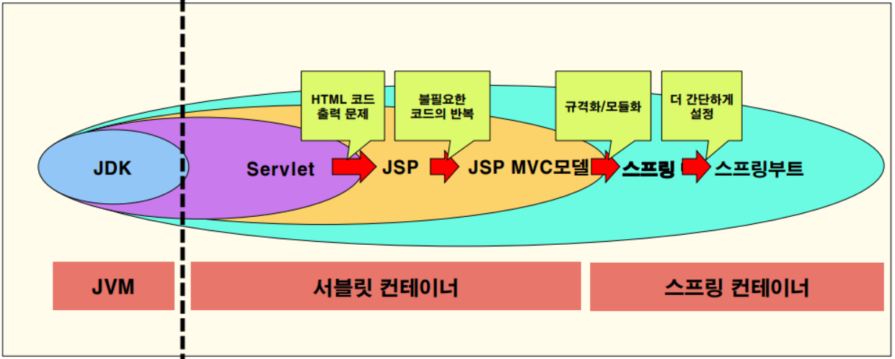
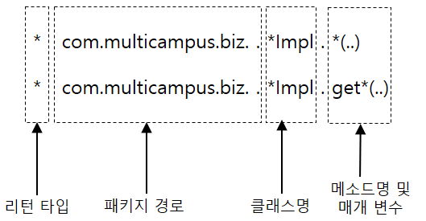
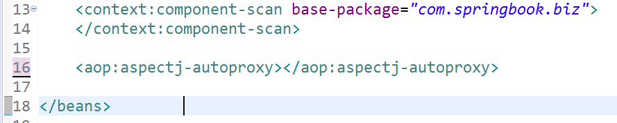
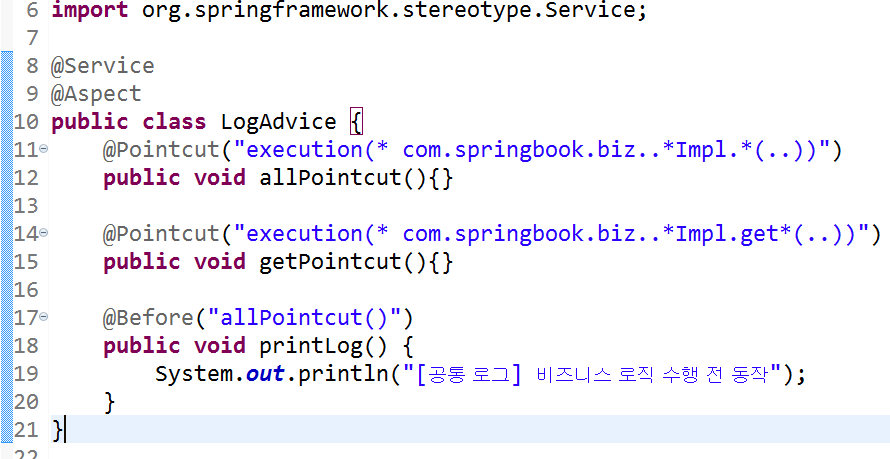

# SpringMidExam
## 1. 스프링 개요
### 1. 웹프로그래밍에 대한 이해
1. **정적인 컨텐츠와 동적인 컨텐츠**<br>
  
  - JSP(Java Server Page)는 HTML 내에 자바 코드를 삽입하여 웹 서버에서 동적으로 웹 페이지를 생성하여 웹 브라우저에게 돌려주는 언어.
  - 웹 페이지는 크게 정적(Static)과 동적(Dynamic)으로 나뉜다.
  - 동적 웹 페이지는 웹 서버에 이미 저장된 파일(HTML, 이미지, JavaScript 등)을 클라이언트에게 전송하는 웹페이지
  - 정적 웹 페이지는 사용자 요청에 따라 동적으로 만들어 전송하는 웹페이지
<br>
<br>

### 2. 자바 웹 프로그래밍 기술의 발전

<br>
<br>

### 3.Servlet(Server Application Let)
1. **Servlet의 개념**<br>
웹 기반의 요청에 대한 동적인 처리가 가능한 하나의 클래스이다.
<br>

2. **Servlet Program의 기본적인 동작 과정**<br>

   1. Web Server는 HTTP request를 WAS(Web Application Server)내에 Web Container(Servlet Container)에게 위임한다.
      1. web.xml 설정에서 어떤 URL과 매핑되어 있는지 확인
      2. 클라이언트(browser)의 요청 URL을 보고 적절한 Servlet을 실행
   2. Web Container는 service() 메서드를 호출하기 전에 Servlet 객체를 메모리에 올린다
      1. Web Container는 적절한 Servlet 파일을 컴파일(.class 파일 생성)한다.
      2. .class 파일을 메모리에 올려 Servlet 객체를 만든다.
      3. 메모리에 로드될 때 Servlet 객체를 초기화하는 init() 메서드가 실행된다.
   3. Web Container는 Request가 올 때마다 thread를 생성하여 처리한다.
      1. 각 thread는 Servlet의 단일 객체에 대한 service() 메서드를 실행한다.
   4. 처리된 결과를 클라이언트에 전송한다.
<br>

3. **Servlet Life Cycle**<br>

   1. Servlet 클래스는 Singleton 클래스이기 때문에 클라이언트의 요청이 들어오면 WAS는 해당 요청에 맞는 Servlet이 메모리에 있는지 확인 후 없으면 Servlet을 생성한다.
   2. Servlet 클래스를 생성하기 위해선 HttpServlet을 무조건 상속 받아야 한다.
      1. 만약 메모리에 없다면 해당 Servlet Class를 메모리에 올린 후(Servlet 객체 생성) `init` 메서드 실행 후 `Service` 실행한다.
      2. 메모리에 있다면 바로 `Service` 메서드를 실행한다.
      3. Servlet Container는 Servlet Life Cycle을 관리해준다.
   3. **콜백 메소드(Callback Method)**
      - 특정 상항이 되면 자동으로 호출하여 실행되는 메소드를 의미한다.
      - 콜백 메소드의 예시로는 init(), service(), destroy() 가 있다.
   4. **init()**
      - 한 번만 수행된다.
      - 클라이언트(browser)의 요청에 따라 적절한 Servlet이 생성되고 이 Servlet이 메모리에 로드될 때 init() 메서드가 호출된다.
      - 역할: Servlet 객체를 초기화
   5. **service(request, response)**
      - 응답에 대한 모든 내용은 service() 메서드에 구현해야 한다.
      - Servlet이 수신한 모든 request에 대해 service() 메서드가 호출된다.
        - HttpServlet을 상속받은 Servlet 클래스(이하 하위 클래스)에서 service() 메서드를 오버라이드하지 않았다면, 그 부모인 HttpServlet의 service()가 호출된다.
        - service() 메서드는 request의 type(HTTP Method: GET, POST, PUT, DELETE 등)에 따라 적절한 메서드(doGet, doPost, doPut, doDelete 등)를 호출한다.
        - 즉, 하위 클래스에서 doGet, doPost 등의 메서드를 오버라이드해두면 HttpServlet의 service() 메서드가 요청에 맞는 메서드(하위 클래스에서 오버라이드한 메서드)를 알아서 호출할 수 있게 되는 것이다.
      - 메서드가 return하면 해당 thread는 제거된다.
   6. **doGet()과 doPost()**
      - 전송 방식에 따라 다르게 사용할 수 있다.
      - doGet()은 URL에 전송 데이터가 노출된다.
      - doPost()는 전송하는 데이터 양이 많고 URL에 전송 데이터가 노출 되지 않는다.
      - doGet()과 doPost()는 필수로 사용해야되는 메소드이지만 그 외에는 필요에 따라 사용하면 된다.
   7. **destroy()**
      - 한 번만 수행된다.
      - Web Application이 갱신되거나(일정시간동안 요청이 없거나) WAS가 종료될 때 호출된다.
      - 역할: Servlet 객체를 메모리에서 제거
<br>

4. **Servlet의 메소드 구현 예시**
   - ``` java
      // `javax.servlet.http.HttpServlet`를 상속받은 Servlet 클래스
      public class LoginServlet extends HttpServlet {
      // doPost()를 재정의 
      protected void doPost(HttpServletRequest request, HttpServletResponse response) throws ServletException, IOException {
          // read form fields
          String username = request.getParameter("username");
          String password = request.getParameter("password");
          
          // get response writer
          PrintWriter writer = response.getWriter();

          /* 여기서 -> DB 접근 등 Business Logic 부분을 처리 */
          
          // build HTML code (view 생성 부분)
          String htmlResponse = "<html>";
          htmlResponse += "<h2>Your username is: " + username + "<br/>";      
          htmlResponse += "Your password is: " + password + "</h2>";    
          htmlResponse += "</html>";	
          
          // return response
          writer.println(htmlResponse);         
      }
      }
      ```
   1. WAS는 웹 브라우저로부터 요청을 받으면
       1. 요청할 때 가지고 있는 정보를 HttpServletRequest객체를 생성하여 저장한다.
       2. 웹 브라우저에게 응답을 보낼 때 사용하기 위하여 HttpServletResponse객체를 생성한다.
       3. 생성된 HttpServletRequest, HttpServletResponse 객체를 Servlet에게 전달한다.
   2. 개발자는 일반적으로 javax.servlet.http.HttpServlet를 상속받은 Servlet 클래스를 작성한다.
       1. HttpServletRequest request 파라미터를 통해 사용자가 입력한 form data를 읽는다.
       2. HttpServletResponse response 파라미터를 통해 출력/결과 Web Page를 생성한다.
   3. Servlet 클래스에 doGet() 또는 doPost() 중 적어도 하나를 재정의하여 작성한다.
      1. `protected void doGet(HttpServletRequest request, HttpServletResponse response) throws ServletException, IOException{}`
      2. `protected void doPost(HttpServletRequest request, HttpServletResponse response) throws ServletException, IOException {}`
         1. **HttpServletRequest request 객체**
            1. 사용자가 HTML Form에 입력한 내용(username과 password)을 request 객체에서 받아온다.
            2. 헤더 정보, 파라미터, 쿠키, URI, URL, Body의 Stream 등을 읽어 들이는 메서드가 있다.
               1. **getHeader(<헤더 이름>)**
                  1. 이 메서드를 통해 원하는 헤더 정보를 확인할 수 있다.
               2. **getParameter()**
                  1. 이 메서드를 호출하여 form parameter 값을 가져온다.
                  2. 이런 parameter 값은 URL 또는 form의 input tag를 통해서 넘어올 수 있다.
                  3. 예시
                  ``` java
                  String name = request.getParameter("firstname");
                  int year = Integer.parseInt (request.getParameter("year"));
                  ```
               3. **getParameterValues()**
                  1. form parameter가 두 번 이상 나타나고 여러 개의 값을 반환할 때 이 메서드를 호출한다. (Ex. checkbox)
                  2. 예시
                  ```java
                  String languages[] = request.getParameterValues("language");
                  ```

         2. **HttpServletResponse response 객체**
            1. 메소드에서 요청 처리 후 요철 결과를 response 객체에 담아 반환한다.
            2. response후 생성된 객체는 사라진다.(정확히는 객체 풀(Object Pool)에 반환되어 재사용가능 상태가 된다.)
            3. **getWriter()**
               1. getWriter() 메서드를 호출하여 PrintWriter 객체, PrintStream객체를 가져온 후 해당 객체에서 print, println 메서드를 실행한다.
               2. 예시
               ```java
               PrintStream out = response.getWriter( );
               out.println( “Hello Servlet!” );
               ```
<br>

5. **Servlet의 Mapping**
   1. 클라이언트의 요청에 따라 Servlet이 생성될 때 사용자가 집적 Servlet Class의 파일 명을 지정하지 못하고 Mapping 정보를 이용해 요청할 수 있다. Mapping 방식은 XML 방식과 Annotation 방식이 있다.<br>
   
   2. **XML(Extensible Markup Language) 방식**
      1. web.xml 파일(Web Deployment Descriptor)에 작성하는 방식이다.
         1. **aliases**
            - 서블릿 이름을 실제 서블릿 클래스에 연결
         2. **mapping**
            - URL을 서블릿 이름에 연결
         3. **namespace(ns)**
            - 태그를 정의하고 있는 공간
            - xml파일의 태그를 정의하는 공간은 xmlns라고 한다.
            - 서버가 요청을 받은 후 web.xml 파일을 읽을 때 <welcom-file>태그 내에 있는 파일 명에 해당하는 파일을 실행한다.
      2. XML 방식을 사용하면 설정파일이 길어진다.
   3. **Annotation 방식**
      - signature(Ex. `public class Hello extends HttpServlet`) 위에 어노테이션(Annotation)을 추가하는 방식이다.

6. **MVC 패턴**
   1. MVC패턴의 최대 장점은 사용자에게 보여지는 프레젠테이션 영역과 비즈니스 로직, 데이터 구조가 서로 완전히 분리되어 있다는 점이다.<br>
   
   2. MVC - Model 1
      - 비즈니스 로직 영역(Controller)에 프레젠테이션 영역(View)을 같이 구현하는 방식
   3. MVC - Model 2
      - 비즈니스 로직 영역과 프레젠테이션 영역이 분리되어 있는 구현 방식
   4. 정리<br>
      | | 모델 1 | 모델 2 |
      | :--: | :--: | :--: |
      | 컨트롤러와 뷰의<br>분리 여부 | 통합(JSP파일) | 분리(JSP, Servlet) |
      | 장점 | 쉽고 빠른 개발 | 디자이너/개발자 분업 유리<br>유지보수에 유리 |
      | 단점 | 유지보수가 어려움 | 설계가 어려움<br>개발 난이도가 높음 |
   5. 시험 포인트
      1. mvc 모델에서 jsp에 데이터를 넘기는 객체는 RequestDispatcher 객체이다.
      2. mvc 모델1, 2 의 가장 큰 차이는 비지니스 로직이 servlet에 있냐 jsp 파일에 있냐의 차이이다.	servlet에 있으면 모델2, jsp 파일에 있으면 모델 1이다.

7. **MVC 모델의 문제점**
   1. 새로운 기능을 추가하기 위해선 새로운 Servlet 추가, Jsp파일 추가, DAO에 관련 쿼리 추가해야된다.
   2. 이는 코드의 무질서가 심해지고 유지보수가 어려워진다.

### Spring Framework
1. Spring Framework
    - IoC와 AOP를 지원하는 경량의 프레임 워크

2. 프레임워크의 장점
   1. 빠른 구현 시간
   2. 쉬운 관리
   3. 개발자들의 역량 획일화
   4. 검증된 아키텍쳐의 재사용과 일관성

3. 스프링의 특징
   1. 경량
    - 스프링 프레임워크가 POJO(Plain Old Java Object)형태의 객체를 관리하기 때문
   2. 제어의 역행(Inversion of Control : IoC):DI 지원
   3. 관점 지향 프로그래밍(Aspect Oriented Programming : AOP) 지원
       -  객체생성을 컨테이너가 대신 처리하기 때문에 결합도가 낮아짐
       -  DI(Dependency Injection)<br>
		의존성 주입이라 하며 jsp에서 컨테이너가 객체를 생성만했지만 spring은 객체의 의존관계를 객체를 파악해 합쳐준다.
   4. 컨테이너 역할
       - 스프링 컨테이너는 빈(bean), 서블릿 컨테이너는 서블릿(Servlet)

4. Spring Framework의 구조
   1. Spring Core(Framework의 가장 기본적인 부분)
   2. Spring AOP
   3. Spring ORM
   4. Spring DAO
   5. Spring Web
   6. Spring Web MVC

5. Spring MVC Architecture
    - MVC Model 2의 문제점을 개선한 아키텍쳐

6. Spring Layered architecture 구조<br>

   1. Presentation Layer
    - Spring MVC 객체를 말한다.
    - 프론트 컨트롤러(DispatcherServlet), 컨트롤러, 뷰, 모델이 포함
   2. Service Layer(Business Layer)
    - presentation layer에서 요청을 보내면 실제로 비지니스로직 수행
   3. Data Access Layer(Repository Layer)
    - DB에 값을 저장하거나 가져오기 위해 JDBC, Mybatis, JPA 등을 사용해 구현한 DAO
   4. 시험 포인트
      1. 스프링 프레임워크는 웹 어플리케이션이 아니다.
      2. 99% 웹으로 구현 할 수 있지만 다는 아니다.
      3. 스프링 컨테이너를 대처하기 위해 서블릿 컨테이너가 탄생하지 않았다. 용도가 다를 뿐이다.
      4. 스프링 컨테이너 내부에 서블릿 컨테이너가 동작한다.
      5. 스프링의 ApplicationContext인 applicationContext.xml의  파일명, 위치는 정해져 있지 않다.(JSP의 Web.xml이다.)
7. gradle, maven
   1. 라이브러리를 자동으로 관리해주는 툴
   2. pom.xml파일은 설정파일인데 maven의 설정파일이다.

8. 스프링 DI 컨테이너의 종류
   1. BeanFactory
    - 스프링에서 가장 기본적인 DI 컨테이너
    - Bean의 생성과 의존성 관리를 담당한다.
   2. ApplicationContext
    - BeanFactory를 상속
    - BeanFactory가 제공하는 기능 외에도 다양한 부가기능을 제공
   3. GenericXmlApplicationContext
    - XML 파일을 이용한 설정 정보를 로딩하여 빈을 생성
    - 스프링의 다양한 설정 기능을 제공하는데, 가장 일반적인 방식입니다.
   4. XmlWebApplicationContext
    - 웹 애플리케이션에서 사용되는 ApplicationContext의 구현체
   5. 이해 돕기
   - 	GenericXmlApplicationContext 스프링 컨테이너는 Service Layer(Business Layer),  Data Access Layer(Repository Layer)를 관리한다.
   - XmlWebApplicationContext 로 만든 스프링 컨테이너는 Presentation Layer를 관리한다.

9. 스프링 컨테이너의 설정 파일(ApplicationContext) 태그
   1. `<beans>`
    - `<bean>`의 생명주기를 관리
    - 시작태그에 네임스페이스를 비롯한 XML 스키마 관련 정보 설정
   2. `<import>`
    - 기능별 여러 XML파일로 분리 설정
   3. `<bean>`
    - 클래스 등록시 사용하는 엘리먼트로서 id속성(생략가능), class속성(필수) 사용
      1. 속성
         1. `init-method`
          - Servlet의 init( )과 같은 역할 : 객체 생성시 초기화 작업
         2. `destory-method`
         3. `lazy-init`
          - 즉시로딩(pre-loading)방식이지만, 요청할 때 생성하도록
         4. `scope`
          - scope속성의 기본값은 싱글톤 : bean 객체가 단 하나만 생성
   4. 출제 포인트
    - spring 컨테이너는 bean의 라이프 사이클을 관리한다.
    - servlet 컨테이너는 servlet의 라이프 사이클을 관리한다.
          

10. IoC(Inversion of Control) : 제어의 역행
    - 프로그램의 흐름을 개발자가 아닌 프레임워크가 주도하게 된다는 디자인패턴
    - 객체의 생성에서 소멸까지 프레임워크가 관리를 하면서 DI(Dependency Injection)나 AOP(Aspect Oriented Programming)가 가능 

11. DI 구현 방법
    1. setter injection
       - 예시
      ```xml
      <bean id="tv" class="com.myspring.step04.SamsungTV"> 
         <property name="speaker" ref="sony"></property>
      </bean> 
      <bean id="sony" class="com.myspring.step04.SonySpeaker"></bean>
      <bean id="apple" class="com.myspring.step04.AppleSpeaker"></bean>
      ```
    2. constructor injection
       - 예시
      ```xml
      <bean id="tv" class="com.myspring.step03.SamsungTV">   
         <constructor-arg ref="so"></constructor-arg>
      </bean> 
      <bean id="so" class="com.myspring.step03.SonySpeaker"></bean>
      <bean id="apple" class="com.myspring.step03.AppleSpeaker"></bean> 
      ```
12. DI 어노테이션 기반 설정
 - Context 네임스페이스 추가
```xml
<beans xmlns="http://www.springframework.org/schema/beans"
   xmlns:xsi="http://www.w3.org/2001/XMLSchema-instance"
   xmlns:p="http://www.springframework.org/schema/p"
   xmlns:context="http://www.springframework.org/schema/context"
   xsi:schemaLocation="http://www.springframework.org/schema/beans 
      http://www.springframework.org/schema/beans/spring-beans.xsd
      http://www.springframework.org/schema/context 
   http://www.springframework.org/schema/context/spring-context-4.2.xsd">

   <context:component-scan base-package="com.springbook.biz"/>
</beans>
```
혹은  \<context:component-scan base-package="com.myspring.step04"></context:component-scan> 을 @ComponentScan("com.myspring.step05")로 변경하여 class 파일에 추가
 - @Component 설정
```xml
xml 방식일 경우의 id
<bean id="tv" class="polymorphism.LgTV"></bean>
```
```java
@Component("tv")
public class LgTV implements TV {
   public LgTV() {
      System.out.println("===> LgTV 성 객체생");
   }
}
```
13.   Dependency Injection 설정
     1. @Autowired
      - 주로 변수 위에 설정하여 해당 타입의 성생를 찾아서 자동으로 할당 
      ```java
      @Component("tv")
      public class LgTV implements TV {
      @Autowired
      private Speaker speaker;
         public LgTV() {
            System.out.println("===> LgTV 성 객체생");
         }
         public void volumeUp() {
            speaker.volumeUp();
         }
         public void volumeDown() {
            speaker.volumeDown();
         }
      }
      ```
     2. @Qualifier
      - 특정 성생의 이름을 이용하여 의존객 주입할 때 사용
      - 의존객 주입 대상 성생가 두 개 이상일 때 에러 발체.
      ```java
      @Component("tv")
      public class LgTV implements TV {
      @Autowired
      @Qualifier("apple")
      private Speaker speaker;
      public LgTV() {
         System.out.println("===> LgTV 성생 체객됨");
         }
         ~생략~
      }
      ```
     3. @Inject
      - @Autowired와 동일한 기능을 제공
      ```java
      @Component("tv")
      public class LgTV implements TV {
      @Resource(name="apple")
      private Speaker speaker;
      public LgTV() {
         System.out.println("===> LgTV 성생 체객됨");
         }
         ~체략~
      }
      ```
     4. @Resource
      - @Autowired와 @Qualifier의 기능을 결합한 어노테이션

14. xml파일이 아닌 class 파일로 ApplicationContext 설정
 - 예시
 ```java
	public static void main(String[] args) {
		AbstractApplicationContext factory = new AnnotationConfigApplicationContext(ApplicationConfig.class);

	}
```
이후 자바파일(ApplicationConfig.java)에서 다음과 같이 설정하면 된다.
```java
	@Configuration
	public class ApplicationConfig {
		<이 안에 인젝션할 클래스를 설정하면 된다.>
	}
```
15. Layer 별 bean객체 선언 Annotation
 - @Component를 상속하여 수행 역활을 분류
    1. @Service
     - 비즈니스 로직을 처리하는 Service 클래스
    2. @Repository
     - 데이터베이스 연동을 처리하는 DAO 클래스
    3. @Controller
     - 사용자 요청을 제어하는 Controller 클래스

### 관점 지향 프로그래밍(AOP)
1. AOP 용어 정리
   1. 조인 포인트
    - 어드바이스가 실행될 수 있는 시점(메소드 호출, 객체 생성 등)을 의미
   2. 포인트 컷
    - 실제 어드바이스가 적용될 조인 포인트를 선택하기 위한 표현식
   3. 어드바이스
    - 특정 조인 포인트에서 실행되는 코드를 의미합니다.
   4. 애스팩트 혹은 어드바이저
    - 어떤 포인트 컷에 대해 어떤 어드바이스를 실행할 지 결정하는 것
   5. 위빙
    - 어드바이스를 포인트 컷에 삽입하는 과정을 의미합니다.

2. AOP와 관련된 다양한 설정 : XML 방식과 어노테이션 방식
   1. XML 기반의 POJO 클래스를 이용한 AOP 구현
    - 부가기능을 제공하는 Advice 클래스를 작성한다.
    - XML 설정 파일에 \<aop:config>를 이용해서 애스펙트를 설정한다.
   2. @Aspect 어노테이션을 이용한 AOP 구현
    - @Aspect 어노테이션을 이용해서 부가기능을 제공하는 Aspect 클래스를 작성한다. 이때 Aspect 클래스는 어드바이스를 구현하는 메서드와 포인트컷을 포함한다. 
    - XML 설정 파일에 <aop:aspectj-autoproxy />를 설정한다.
    
3. AOP 설정 : XML 방식

 
   1. 어드바이스 동작 시점
      1.  Before<br>
       - 비즈니스 메소드 실행 전 동작
      2. After
        1. After Returning
         - 비즈니스 메소드가 성공적으로 반환되면 동작
        2. After Throwing
         - 비즈니스 메소드 실행 중 예외가 발생하면 동작<br>(try~catch 블록에서 catch 블록에 해당)
        3. After
         - 비즈니스 메소드가 실행된 후, 무조건 실행<br>(try~catch~finally 블록에서 finally 블록에 해당)
      3. Around
       - Around는 메소드 호출 자체를 가로채 비즈니스 메소드 실행 전후에 처리할 로직을 삽입할 수 있음
       - 예시
       ```java
       	public class AroundAdvice {
            public Object aroundLog(ProceedingJoinPoint pjp) throws Throwable {
               System.out.println("[BEFORE]: 비즈니스 메소드 수행 전에 처리할 내용...");
               Object returnObj = pjp.proceed();
               System.out.println("[AFTER]: 비즈니스 메소드 수행 후에 처리할 내용...");
               return returnObj;
            }
         }
       ```
       ```xml
       <aop:around pointcut-ref="allPointcut" method="aroundLog" />
       ```
       `pjp.proceed();` 메소드가 실행되면 앞에서 잡아둔 포인트 컷이 실행된다.
   2. JointPoint 메소드
      1. Signature getSignature()
       - 클라이언트가 호출한 메소드의 시그니처(반환형, 이름, 매개변수) 정보가 저장된 Signature 객체 반환
      2. Object getTarget()
       - 클라이언트가 호출한 비즈니스 메소드를 포함하는 비즈니스 객체 반환
      3. Object[] getArgs()
       - 클라이언트가 메소드를 호출할 때 넘겨준 인자 목록을 Object 배열로 반환
   3. ProceedingJointPoint 인터페이스
    - JointPoint를 상속받은 인터페이스이며, jointPoint메소드+proceed()메소드 추가

4. AOP 설정 : 어노테이션 방식
   1. 먼저 스프링 설정파일에 \<aop:aspect-autoproxy> 엘리먼트 선언<br>
   
   2. AOP 관련 어노테이션들은 어드바이스 클래스에 설정<br>
   
   3. 어드바이스 동작 시점 관련 어노테이션
      1. @Before 
       - 비즈니스 메소드 실행 전에 동작
      2. @AfterReturning
       - 비즈니스 메소드가 성공적으로 반환되면 동작
      3. @AfterThrowing
       - 비즈니스 메소드 실행 중 예외가 발생하면 동작<br>(마치 try~catch 블록에서 catch 블록에 해당).
      4. @After
       - 비즈니스 메소드가 실행된 후, 무조건 실행<br>(try~catch~finally 블록에서 finally 블록에 해당)
      5. @Around
       - 호출 자체를 가로채 비즈니스 메소드 실행 전후에 처리할 로직을 삽입할수 있음