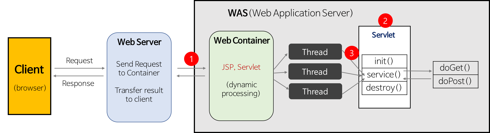
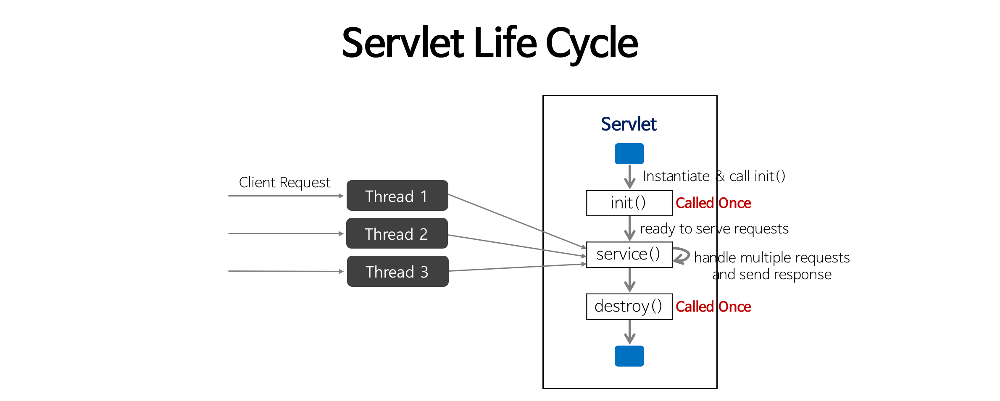
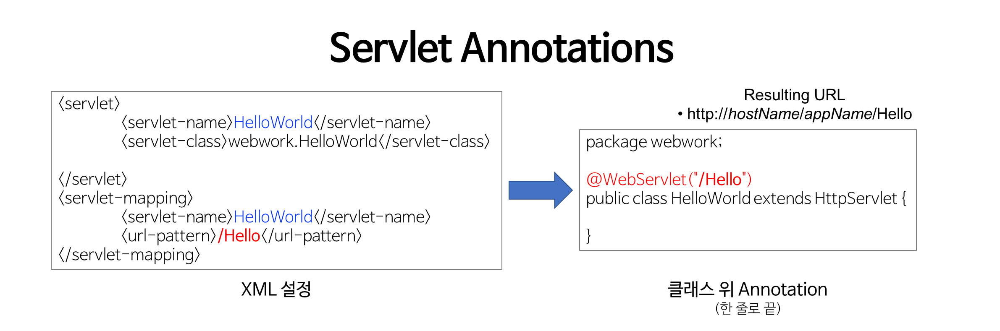

# SpringMidExam
## 1. 스프링 개요
### 1. 웹프로그래밍에 대한 이해
1. 정적인 컨텐츠와 동적인 컨텐츠<br>
  
  - JSP(Java Server Page)는 HTML 내에 자바 코드를 삽입하여 웹 서버에서 동적으로 웹 페이지를 생성하여 웹 브라우저에게 돌려주는 언어.
  - 웹 페이지는 크게 정적(Static)과 동적(Dynamic)으로 나뉜다.
  - 동적 웹 페이지는 웹 서버에 이미 저장된 파일(HTML, 이미지, JavaScript 등)을 클라이언트에게 전송하는 웹페이지
  - 정적 웹 페이지는 사용자 요청에 따라 동적으로 만들어 전송하는 웹페이지

2. Servlet(Server Application Let)
   1. Servlet의 개념
      - 웹 기반의 요청에 대한 동적인 처리가 가능한 하나의 클래스이다.
   2. Servlet Program의 기본적인 동작 과정<br>
   
      1. Web Server는 HTTP request를 WAS(Web Application Server)내에 Web Container(Servlet Container)에게 위임한다.
         1. web.xml 설정에서 어떤 URL과 매핑되어 있는지 확인
         2. 클라이언트(browser)의 요청 URL을 보고 적절한 Servlet을 실행
      2. Web Container는 service() 메서드를 호출하기 전에 Servlet 객체를 메모리에 올린다
         1. Web Container는 적절한 Servlet 파일을 컴파일(.class 파일 생성)한다.
         2. .class 파일을 메모리에 올려 Servlet 객체를 만든다.
         3. 메모리에 로드될 때 Servlet 객체를 초기화하는 init() 메서드가 실행된다.
      3.  Web Container는 Request가 올 때마다 thread(수업에선 Request 객체라 표현)를 생성하여 처리한다.
          1.  각 thread는 Servlet의 단일 객체에 대한 service() 메서드를 실행한다.
   3. Servlet Life Cycle
   
      1. Servlet 클래스는 Singleton 클래스이기 때문에 클라이언트의 요청이 들어오면 WAS는 해당 요청에 맞는 Servlet이 메모리에 있는지 확인 후 없으면 Servlet을 생성한다.
      2. Servlet 클래스를 생성하기 위해선 HttpServlet을 무조건 상속 받아야 한다.
         1. 만약 메모리에 없다면 해당 Servlet Class를 메모리에 올린 후(Servlet 객체 생성) `init` 메서드 실행 후 `Service` 실행한다.
         2. 메모리에 있다면 바로 `Service` 메서드를 실행한다.
         3. Servlet Container는 Servlet Life Cycle을 관리해준다.
      3. 콜백 메소드(Callback Method)
         - 특정 상항이 되면 자동으로 호출하여 실행되는 메소드를 의미한다.
         - 콜백 메소드의 예시로는 init(), service(), destroy() 가 있다.
      4. init()
         - 한 번만 수행된다.
         - 클라이언트(browser)의 요청에 따라 적절한 Servlet이 생성되고 이 Servlet이 메모리에 로드될 때 init() 메서드가 호출된다.
         - 역할: Servlet 객체를 초기화
      5. service(request, response)
         - 응답에 대한 모든 내용은 service() 메서드에 구현해야 한다.
         - Servlet이 수신한 모든 request에 대해 service() 메서드가 호출된다.
          - HttpServlet을 상속받은 Servlet 클래스(이하 하위 클래스)에서 service() 메서드를 오버라이드하지 않았다면, 그 부모인 HttpServlet의 service()가 호출된다.
          - HttpServlet의 service() 메서드는 템플릿 메서드 패턴으로 구현되어 있다.
          - service() 메서드는 request의 type(HTTP Method: GET, POST, PUT, DELETE 등)에 따라 적절한 메서드(doGet, doPost, doPut, doDelete 등)를 호출한다.
          - 즉, 하위 클래스에서 doGet, doPost 등의 메서드를 오버라이드해두면 HttpServlet의 service() 메서드가 요청에 맞는 메서드(하위 클래스에서 오버라이드한 메서드)를 알아서 호출할 수 있게 되는 것이다.
         - 메서드가 return하면 해당 thread는 제거된다.
      6. doGet()과 doPost()
         - 전송 방식에 따라 다르게 사용할 수 있다.
         - doGet()은 URL에 전송 데이터가 노출된다.
         - doPost()는 전송하는 데이터 양이 많고 URL에 전송 데이터가 노출 되지 않는다.
         - doGet()과 doPost()는 필수로 사용해야되는 메소드이지만 그 외에는 필요에 따라 사용하면 된다.
      7. destroy()
         - 한 번만 수행된다.
         - Web Application이 갱신되거나(일정시간동안 요청이 없거나) WAS가 종료될 때 호출된다.
         - 역할: Servlet 객체를 메모리에서 제거
   4. Servlet의 메소드 구현 예시
   ``` java
   // `javax.servlet.http.HttpServlet`를 상속받은 Servlet 클래스
   public class LoginServlet extends HttpServlet {
      // doPost()를 재정의 
      protected void doPost(HttpServletRequest request, HttpServletResponse response) throws ServletException, IOException {
          // read form fields
          String username = request.getParameter("username");
          String password = request.getParameter("password");
          
          // get response writer
          PrintWriter writer = response.getWriter();

          /* 여기서 -> DB 접근 등 Business Logic 부분을 처리 */
          
          // build HTML code (view 생성 부분)
          String htmlResponse = "<html>";
          htmlResponse += "<h2>Your username is: " + username + "<br/>";      
          htmlResponse += "Your password is: " + password + "</h2>";    
          htmlResponse += "</html>";	
          
          // return response
          writer.println(htmlResponse);         
      }
   }
   ```
      1.  WAS는 웹 브라우저로부터 요청을 받으면
        1. 요청할 때 가지고 있는 정보를 HttpServletRequest객체를 생성하여 저장한다.
        2. 웹 브라우저에게 응답을 보낼 때 사용하기 위하여 HttpServletResponse객체를 생성한다.
        3. 생성된 HttpServletRequest, HttpServletResponse 객체를 Servlet에게 전달한다.
      2.  개발자는 일반적으로 javax.servlet.http.HttpServlet를 상속받은 Servlet 클래스를 작성한다.
        1. HttpServletRequest request 파라미터를 통해 사용자가 입력한 form data를 읽는다.
        2. HttpServletResponse response 파라미터를 통해 출력/결과 Web Page를 생성한다.
      3.  Servlet 클래스에 doGet() 또는 doPost() 중 적어도 하나를 재정의하여 작성한다.
          1. `protected void doGet(HttpServletRequest request, HttpServletResponse response) throws ServletException, IOException{}`
          2. `protected void doPost(HttpServletRequest request, HttpServletResponse response) throws ServletException, IOException {}`
          3. HttpServletRequest request 객체와 HttpServletResponse response 객체
             1. HttpServletRequest request 객체
                1. 사용자가 HTML Form에 입력한 내용(username과 password)을 request 객체에서 받아온다.
                2. 이걸 Servlet Container가 처리한다.
             2. HttpServletResponse response 객체
                1. 메소드에서 요청 처리 후 요철 결과를 response 객체에 담아 반환한다.
                2. response후 생성된 객체는 사라진다.(정확히는 객체 풀(Object Pool)에 반환되어 재사용가능 상태가 된다.)
  

3. Servlet의 Mapping
   1. 클라이언트의 요청에 따라 Servlet이 생성될 때 사용자가 집적 Servlet Class의 파일 명을 지정하지 못하고 Mapping 정보를 이용해 요청할 수 있다. Mapping 방식은 XML 방식과 Annotation 방식이 있다.<br>
   
   2. XML(Extensible Markup Language) 방식
      1. web.xml 파일(Web Deployment Descriptor)에 작성하는 방식이다.
         1. aliases
            -  서블릿 이름을 실제 서블릿 클래스에 연결
         2. mapping
            - URL을 서블릿 이름에 연결
         3. namespace(ns)
            - 태그를 정의하고 있는 공간
            - xml파일의 태그를 정의하는 공간은 xmlns라고 한다.
            - 서버가 요청을 받은 후 web.xml 파일을 읽을 때 <welcom-file>태그 내에 있는 파일 명에 해당하는 파일을 실행한다.
      2. XML 방식을 사용하면 설정파일이 길어진다.
   3. Annotation 방식
      - signature(ex: `public class Hello extends HttpServlet`) 위에 어노테이션(Annotation)을 추가하는 방식이다.